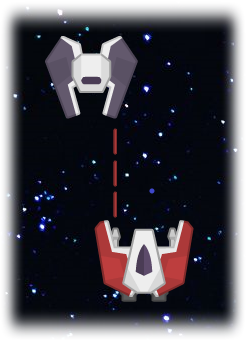

# Space-Shooter-Unity-Game 
Personal project - Space Shooter 2D 2020  
Inside Project folder you can find images of game UI and/or project documentation. 

## Installing
To install all the dependencies needed to run the game, open the project in Unity Engine.

## Built With
* Unity 
* C#

## Links
[Bensound](https://www.bensound.com) 
[FreeSound](https://freesound.org) 
[Kenney game assets](https://www.kenney.nl) 
